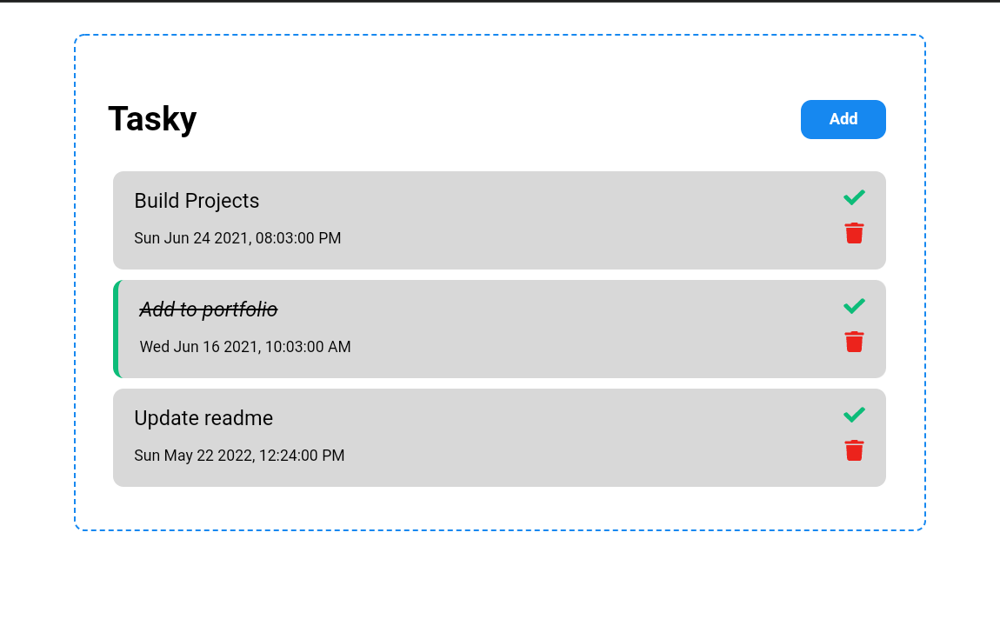

<div align = "center">

<h1><a href="https://2kabhishek.github.io/tasky">tasky</a></h1>

<a href="https://github.com/2KAbhishek/tasky/blob/main/LICENSE">
 </a>

<a href="https://github.com/2KAbhishek/tasky/graphs/contributors">
 </a>

<a href="https://github.com/2KAbhishek/tasky/stargazers">
</a>

<a href="https://github.com/2KAbhishek/tasky/network/members">
 </a>

<a href="https://github.com/2KAbhishek/tasky/watchers">
 </a>

<a href="https://github.com/2KAbhishek/tasky/pulse">
 </a>

<h3>Task management with React ✅📋</h3>

<figure>
  
  <br/>
  <figcaption>tasky Screenshot</figcaption>
</figure>

</div>

## What is this

A task manager built with React, can be integrated with any Backend.

## Inspiration

Needed a frontend component to test different backends.

## Prerequisites

Before you begin, ensure you have met the following requirements:

- You have installed the latest version of `npm`

## Installing

To install , follow these steps:

```bash
git clone https://github.com/2kabhishek/tasky
cd tasky
npm install
```

## How it was built

tasky was built using `react`

## What I learned

- Integrate react with gh-pages
- Use propTypes
- Always fun to work with react

Hit the :star: button if you found this useful.

## More Info

<div align="center">

<a href="https://github.com/2KAbhishek/">Source</a> |
<a href="https://2kabhishek.github.io/">Website</a>

</div>
